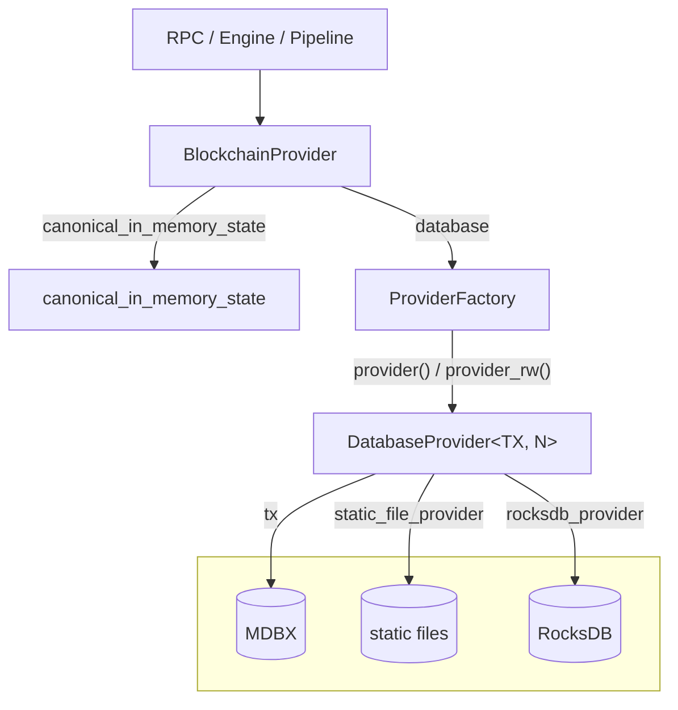

# storage/provider 자료구조

> 8주차 월요일 — `crates/storage/provider` 심층 분석 (1)
> 기준: 로컬 main (`84f4c989cb`). 외부 문서/블로그는 백엔드를 2개(MDBX + static file)로
> 설명하는 경우가 많은데, 현재 코드는 **RocksDB를 포함한 3개**다.

---

## 1. 계층

`storage/provider`는 "블록체인 상태를 어떻게 조회/저장하는가"를 4층으로 나눠 놓았다.

```
[ RPC / Engine / Pipeline ]     묻는 쪽
        ↓
  BlockchainProvider            3층: 디스크 + 아직 안 내려간 인메모리 블록을 함께 관리
        ↓
  ProviderFactory               2층: 저장소 핸들을 들고 있다가 provider를 찍어내는 공장
        ↓
  DatabaseProvider              1층: 트랜잭션 하나를 쥔 실제 일꾼
        ↓
[ MDBX ] [ static files ] [ RocksDB ]   0층: 실제 저장소
```

핵심 직관: **`ProviderFactory`는 "연결"이고 `DatabaseProvider`는 "한 번의 조회 세션"이다.**
공장은 계속 살아있고, provider는 짧게 만들었다 버린다. DB 커넥션 풀에서 커넥션을 하나
빌려오는 것과 같은 구도.

`BlockchainProvider`는 그 위에서 **온체인 인터랙션의 첫 진입점** 역할을 한다. 디스크에
확정된 데이터는 아래(`ProviderFactory`)로 위임하고, 아직 확정되지 않은 최신 블록은 자기가
메모리에 들고 답한다.

> 왜 층을 이렇게 나눴는가에 대한 답은 금요일(`design-rationale.md`)에서 다룬다.

---

## 2. 핵심 struct

| 이름 | 위치 | 뭘 들고 있나 | 수명 |
|---|---|---|---|
| `BlockchainProvider<N>` | `crates/storage/provider/src/providers/blockchain_provider.rs:66` | `database: ProviderFactory<N>`, `canonical_in_memory_state`, `bal_store` | **길다.** 노드가 사는 동안 계속 |
| `ProviderFactory<N>` | `crates/storage/provider/src/providers/database/mod.rs:77` | `db`(MDBX Environment), `static_file_provider`, `rocksdb_provider`, `chain_spec`, `storage_settings`, `bal_store`, `runtime` 등 | **길다.** 저장소 연결 그 자체 |
| `DatabaseProvider<TX, N>` | `crates/storage/provider/src/providers/database/provider.rs:187` | `tx`(MDBX **트랜잭션**), `static_file_provider`, `rocksdb_provider` + 팩토리에서 복사된 설정들 | **짧다.** 조회/쓰기 한 묶음 끝나면 버림 |

### 필드에서 읽어낼 수 있는 것

- `chain_spec: Arc<N::ChainSpec>` — 락 없음 → **런타임에 안 바뀌는 값**
- `storage_settings: Arc<RwLock<StorageSettings>>` — 락 있음 → **런타임에 바뀔 수 있는 값**

필드에 락이 붙었는지만 봐도 그 데이터가 변하는지 알 수 있다.

### `bal_store`

BAL = Block Access List (EIP-7928). 블록 실행 중 **어떤 계정/스토리지 슬롯을 건드렸는지**의
목록으로, 트랜잭션 병렬 실행 판단에 쓰인다.

`crates/storage/provider/src/bal.rs:18`의 `InMemoryBalStore`가 구현체인데, 이름 그대로
**디스크가 아니라 메모리**에 산다. `BAL_RETENTION_PERIOD_SLOTS`만큼만 보관하고 버린다.
→ "최근 것만 잠깐 들고 있으면 되는 데이터"라 MDBX도 static file도 아닌 별도 메모리 저장소에 있다.

---

## 3. `db`와 `tx`의 관계 (★ 오늘의 핵심)

세 저장소 핸들이 `ProviderFactory` → `DatabaseProvider`로 넘어갈 때 **MDBX만 성질이 다르다.**

`providers/database/mod.rs:383` `provider()`:

```rust
let db_tx = self.db.tx()?;                 // ★ 변환: Environment → Transaction
Ok(DatabaseProvider::new(
    db_tx,
    ...
    self.static_file_provider.clone(),     // 핸들 복사
    self.rocksdb_provider.clone(),         // 핸들 복사
))
```

| | ProviderFactory | → | DatabaseProvider | 방식 |
|---|---|---|---|---|
| MDBX | `db: N::DB` (**Environment**) | → | `tx: TX` (**Transaction**) | `.tx()` 호출 = **변환** |
| static file | `static_file_provider` | → | 동일 | `.clone()` = 핸들 복사 |
| RocksDB | `rocksdb_provider` | → | 동일 | `.clone()` = 핸들 복사 |

즉 **`db`와 `tx`는 같은 게 아니라 부모와 자식**이다.

```
MDBX (엔진 = libmdbx)
 └─ Environment    ← ProviderFactory의 `db`. 건물 열쇠. 오래 산다
     └─ Transaction ← DatabaseProvider의 `tx`. 한 번의 방문. 짧게 산다
         └─ Cursor  ← 테이블 순회 도구
```

`.clone()`은 데이터 복사가 아니라 **핸들 복사**다(내부가 `Arc`). 액터에게 주소를 넘겨주는 것과
같은 개념.

트랜잭션 발급이 타입으로 정의된 곳 — `crates/storage/db-api/src/database.rs:11`:

```rust
pub trait Database: Send + Sync + Debug {
    type TX: DbTx + ...;        // 읽기 트랜잭션 타입
    type TXMut: DbTxMut + ...;  // 쓰기 트랜잭션 타입
    fn tx(&self) -> Result<Self::TX, DatabaseError>;
    fn tx_mut(&self) -> Result<Self::TXMut, DatabaseError>;
}
```

**`Database` 트레이트 = "트랜잭션을 발급할 수 있는 것"** 이라는 정의다.

---

## 4. RO / RW 분리

`providers/database/provider.rs:106`, `:113`:

```rust
pub type DatabaseProviderRO<DB, N> = DatabaseProvider<<DB as Database>::TX, N>;

pub struct DatabaseProviderRW<DB: Database, N: NodeTypes>(
    pub DatabaseProvider<<DB as Database>::TXMut, N>,
);
```

- `RO` = **타입 별칭**. 새 타입이 아니라 긴 이름의 줄임말
- `RW` = **newtype struct**. 원래는 별칭이고 싶었으나 컴파일러 이슈(rust-lang#102211)로
  감쌌다는 주석이 `:110`에 있음 → 설계 의도가 아니라 우회책
- `:117-129`의 `Deref`/`DerefMut` 구현 덕에 `provider.0.foo()` 대신 `provider.foo()`로 쓸 수 있다

### 왜 타입 수준에서 강제하는가

1. **런타임 에러 → 컴파일 에러.** 읽기 전용 트랜잭션에 쓰기를 시도하면 노드가 돌다 죽는 게
   아니라 빌드가 안 된다.
2. **함수 시그니처가 곧 권한 명세.** `fn f(p: &DatabaseProviderRO<..>)`를 보면 본문을 안 읽어도
   이 함수가 상태를 안 바꾼다는 게 보장된다. 5000줄짜리 파일에서 이건 큰 차이.
3. **MDBX 정책이 타입에 반영됨.** MDBX는 *읽기 트랜잭션 여럿 + 쓰기 트랜잭션 동시에 하나*다.
   즉 `TXMut`는 희소 자원이고, 타입이 다르면 "오래 잡고 있으면 안 되는 값"이라는 게 드러난다.

한 줄: **"실수를 못 하게 막는다"가 아니라 "실수가 컴파일 타임에 드러나고, 의도가 시그니처에
드러난다".**

---

## 5. 트레이트 분류

트레이트는 `crates/storage/provider`가 아니라 **별도 크레이트 `crates/storage/storage-api/`**에
있다. 50개가 넘지만 다 읽을 필요는 없고, 두 축으로 색인만 만들어두면 된다.

- **축1 — 데이터 종류** = 파일명: `account` / `block` / `header` / `transactions` / `receipts` /
  `state` / `trie` / ...
- **축2 — 방향** = 접미사:
  - `...Reader` / `...Provider` → 읽기
  - `...Writer` → 쓰기
  - `...Factory` → 다른 provider를 만들어줌
  - `...Ext` → 기본 트레이트의 확장/편의 함수

| 데이터 | 파일 | 읽기 | 쓰기 |
|---|---|---|---|
| 계정 | `account.rs` | `AccountReader`, `AccountExtReader`, `ChangeSetReader` | — |
| 블록 | `block.rs`, `block_writer.rs` | `BlockReader`, `BlockReaderIdExt`, `ChainStateBlockReader` | `ChainStateBlockWriter`, `BlockWriter`, `BlockExecutionWriter` |
| 헤더 | `header.rs` | `HeaderProvider` | — |
| 트랜잭션 | `transactions.rs` | `TransactionsProvider`, `TransactionsProviderExt` | — |
| 영수증 | `receipts.rs` | `ReceiptProvider`, `ReceiptProviderIdExt` | — |
| 상태 | `state.rs`, `state_writer.rs` | `StateReader`, `StateProvider`, `AccountInfoReader`, `BytecodeReader`, `StateProviderFactory` | `StateWriter` |
| 트라이 | `trie.rs` | `StateRootProvider`, `StorageRootProvider`, `StateProofProvider` | `TrieWriter`, `StorageTrieWriter` |

**struct는 "무엇을 갖고 있나", trait는 "무엇을 물어볼 수 있나".** `DatabaseProvider` 하나가
이 트레이트들을 수십 개 구현하므로, provider 하나로 계정도 블록도 영수증도 다 물어볼 수 있다.

### 이번 주 정밀 분석 대상: `AccountReader`

`crates/storage/storage-api/src/account.rs:14` — 함수가 딱 하나라 추적하기 가장 쉽다.

```rust
#[auto_impl(&, Arc, Box)]
pub trait AccountReader {
    fn basic_account(&self, address: &Address) -> ProviderResult<Option<Account>>;
}
```

- `Option<Account>` — 계정이 **없을 수도** 있다
- `ProviderResult<..>` — DB 조회가 **실패할 수도** 있다
- 두 겹의 불확실성이 반환 타입에 그대로 드러나 있다
- `#[auto_impl(&, Arc, Box)]` — `T`가 구현하면 `&T`, `Arc<T>`, `Box<T>`도 자동 구현되게 하는 매크로

---

## 6. 관계 다이어그램



화살표 라벨은 **그 연결을 만드는 필드 또는 메서드 이름**이다.

**`ProviderFactory` → `DatabaseProvider`** — 두 메서드가 같은 struct를 만들고, `TX` 자리만 다르다.

| 메서드 | `TX` 자리에 들어가는 타입 | 결과 타입 |
|---|---|---|
| `provider()` | `Database::TX` (읽기 전용) | `DatabaseProviderRO` |
| `provider_rw()` | `Database::TXMut` (읽기·쓰기) | `DatabaseProviderRW` |

> **RO/RW는 세 백엔드를 똑같이 갖는다.** 갈리는 건 MDBX 트랜잭션의 종류 하나뿐이고,
> static file / RocksDB 핸들은 양쪽에 동일하게 복사된다
> (`mod.rs:396-400` vs `mod.rs:419-423` 비교).

---

## 7. 오늘 생긴 질문 (다음 세션에서 답할 것)

1. **왜 MDBX만 트랜잭션이고 static file / RocksDB는 핸들 복사인가?**
   → `mod.rs:386-390` 주석에 힌트: *"Sync providers **after** opening the database transaction to
   make sure that no data is pruned from rocksdb or static files."*
   MDBX 트랜잭션을 **먼저 열고** 나머지를 동기화한다는 순서가 명시돼 있다.
   가설: MDBX 트랜잭션이 일종의 "시간 정지" 역할을 해서, 그게 열려 있는 동안은 다른 저장소도
   데이터를 지우지 못하게 되는 구조? (→ 수요일 동시성 세션)

2. 데이터가 static file로 갈지 MDBX로 갈지 RocksDB로 갈지는 **누가 어디서** 정하는가? (→ 목요일)

3. `DatabaseProviderRW`를 별칭이 아니라 struct로 감싼 게 순전히 컴파일러 이슈 때문인가, 아니면
   결과적으로 이득도 있나? (→ 금요일)

4. 왜 트레이트를 `storage-api`라는 **별도 크레이트**로 빼냈는가? (→ 금요일)
